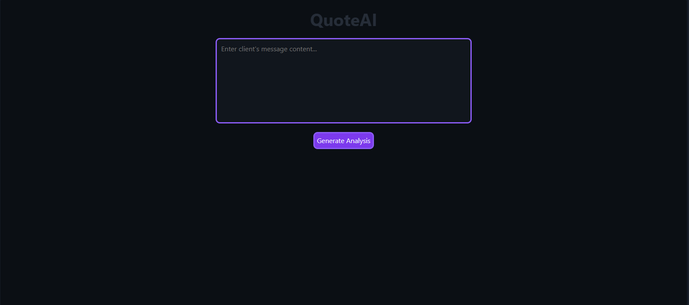
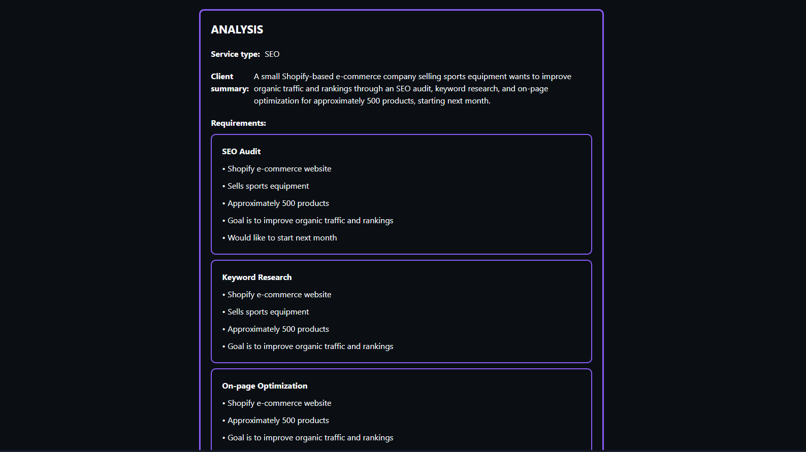
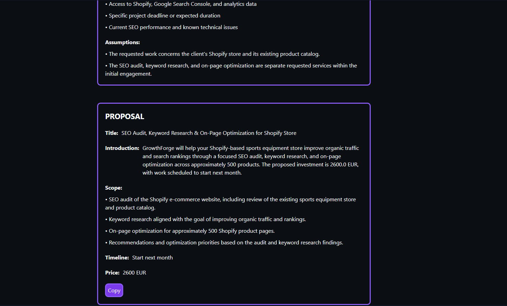
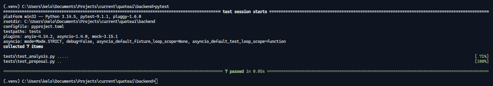

## About the Project

QuoteAI is a useful tool for SEO agencies that enables quick and easy analysis of client messages. The analysis provides clear and structured data from client messages, which can later be used to generate an offer proposal.

QuoteAI can save SEO agencies a significant amount of time spent manually analyzing client messages, helping reduce operational costs.

## Features

- AI analysis of client messages
- Automatic extraction of project requirements
- Structured SEO project data
- AI-generated offer proposals
- Customizable company data — company_data.json allows agencies to define their company information, services, and other details used when generating proposals.
- Customizable pricing — pricing.json allows agencies to configure their own services, pricing, and rates.
- Company-specific proposals — generated proposals are based on the agency's own company data and pricing configuration.
- OpenAI API integration using the user's own API key
- Reduced manual analysis and proposal preparation time

## Video Demo

[Watch the QuoteAI Demo](https://youtu.be/aGuWtPxm8Ss)

> This demo shows the complete QuoteAI workflow, from analyzing a client message to generating a structured SEO offer proposal using AI.

## Screenshots

### QuoteAI



### Analysis



### Proposal



### Tests



## Installation

### Prerequisites

Make sure Git and Node.js are installed.

### 1. Clone the repository

```
git clone https://github.com/Kelooo0/quoteai.git
cd quoteai
```

### 2. Configure environment variables

Navigate to the `backend` directory and create a `.env` file based on `.env.example`.

If you want to use the mock version without AI integration, you don't need to change anything.

If you want to enable AI integration, provide your OpenAI API key in the `OPENAI_API_KEY` field and set `LLM_PROVIDER` to `openai`.

The API key can be generated on the [OpenAI Platform](https://platform.openai.com/).

```
cd backend
cp .env.example .env
```

Next, create the frontend environment file:

```
cd ../frontend
cp .env.example .env
```

### 3. Run the application

In the `backend` directory, run:

```
python -m venv .venv
source .venv/bin/activate
pip install -r requirements.txt
uvicorn app.main:app --reload
```

In another terminal, navigate to the `frontend` directory and run:

```
npm install
npm run dev
```

The application will be available at `http://localhost:5173`.

